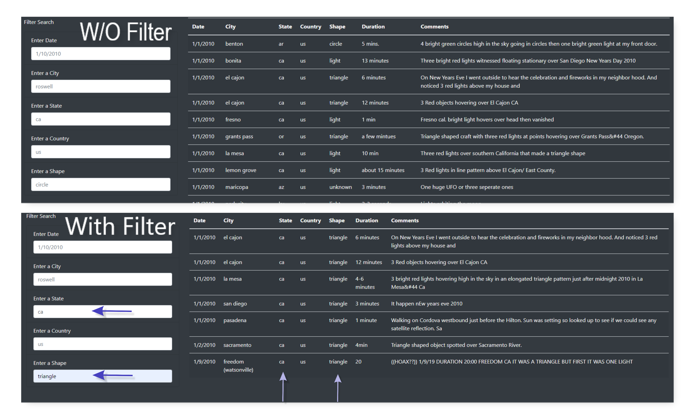

# UFOs
Using JavaScript to create an HTML webpage to hold UFO sightings data

## Overview of Project
The purpose of this project is to use JavaScript with HTML, CSS, and Bootstrap to create and style a dynamic webpage that users can filter UFO sightings. A selected image was used as the background for the jumbotron.

### Built With
- JavaScript
- HTML
- Bootstrap
- CSS

## Results
The webpage opens to a title and article on UFO sightings as depicted below. The page has a dark background with white font and can can adjust according to the device screen size.

Using the JavaScript D3 library, the webpage allows users to filter the table data by date, city, state, country, and shape. The user will enter their search criteria under filters and the table is automatically filtered to selection. Users must follow format for entries. In the image that follows, the table is unfiltered and then filtered with multiple show UFO sightings in state: 'ca' that had shape:'triangle'. This search returns 7 UFO sightings. 

## Summary
Using JavaScript and HTML created a clean, functional, and dynamic webpage that allows users to filter through a dataset in table form. However, since the source of the data is limited to the provided dataset, the user is only able to search the data in the source file. To make the page more interesting, more data should be added or update the dataset to include only the year before the current year. For example, change the sight to "Last Years UFO Sightings" and add only 2020 sightings. In 2022, delete 2020's dataset and add 2021's and so forth. 

In addition to updating the source file, adding a total count for the number of sightings would be useful. When filtering a table it's typical to see the total number of results returned. The user has no idea how many records they are searching and how how many records are returned after a search. For example, searching for sightings in California returns a long list of records. If the user wanted to know the total number of sightings in California they would have to manually count the records on the screen. Ideally, it's easier and faster to programmatically count the number of records. 
